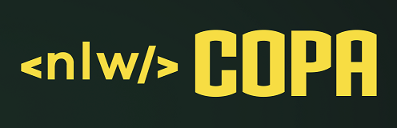

<h1 align="center">
  
</h1>

  <a href="#technologist-tecnologias">Tecnologias</a>&nbsp;&nbsp;&nbsp;|&nbsp;&nbsp;&nbsp;
  <a href="#-projeto">Projeto</a>&nbsp;&nbsp;&nbsp;|&nbsp;&nbsp;&nbsp;
  <a href="#scroll-regras">Regras</a>&nbsp;&nbsp;&nbsp;|&nbsp;&nbsp;&nbsp;
  <a href="#-como-executar">Como executar</a>&nbsp;&nbsp;&nbsp;|&nbsp;&nbsp;&nbsp;
  <a href="#-licença">Licença</a>

## :technologist: Tecnologias

Este projeto faz uso das seguintes tecnologias:
- [NodeJS](https://nodejs.org/)
- [SQLite](https://www.sqlite.org/)
- [TypeScript](https://www.typescriptlang.org/)
- [Prisma](https://www.prisma.io/)
- WIP :warning:

## 💻 Projeto

O NLW Copa é uma aplicação backend que expõe as rotas base para a criação do bolão da Copa.
Essa aplicação é resultado das aulas do Next Level Week Copa na plataforma da Rocketseat.

## :scroll: Regras

- WIP :warning:

## 🚀 Como executar

- Clone o repositório
- Instale as dependências com `yarn install`
- Inicie o servidor WIP :warning:

O servidor deverá iniciar no endereço: WIP :warning:

## 📄 Licença

WIP :warning:

## ♥ Agradecimento

A toda a equipe da Rocketseat por mostrar os caminhos para o próximo nível!